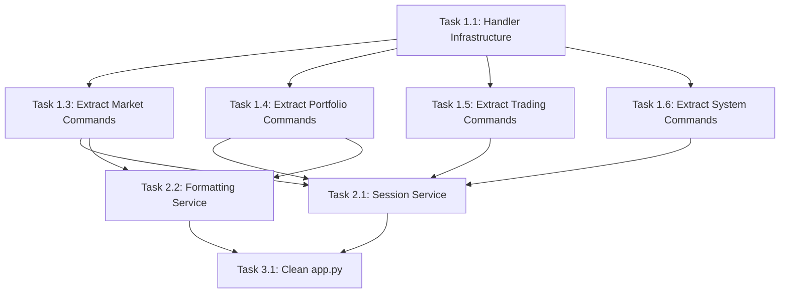

# Telegram Router Refactoring Roadmap

## Overview
The `app.py` file has grown to 1106 lines with significant code duplication and mixed responsibilities. This document outlines a structured approach to refactor the codebase while **preserving all existing functionality** and **reusing existing infrastructure**.

## Critical Requirements
🚨 **NO CODE SHOULD BREAK** - All existing functionality must remain intact
🔧 **REUSE EXISTING CODE** - Leverage existing modules in `app/core/`, `app/ui/`, and `app/connectors/`
✅ **INCREMENTAL APPROACH** - Refactor in small, testable steps
📋 **TEST COVERAGE** - Run existing tests after each step to ensure nothing breaks

## Current Structure Analysis

### Existing Infrastructure (DO NOT MODIFY - REUSE)
```
app/
├── core/               # ✅ Well-structured - REUSE
│   ├── sessions.py     # Session storage logic
│   ├── registry.py     # Command definitions
│   ├── templates.py    # Formatting utilities
│   ├── dispatcher.py   # Service routing
│   ├── parser.py       # Text parsing
│   └── validator.py    # Input validation
├── ui/                 # ✅ Well-structured - REUSE
│   ├── loader.py       # Config loading
│   └── renderer.py     # UI rendering
├── connectors/         # ✅ Well-structured - REUSE
│   ├── http.py         # HTTP client
│   ├── market_data.py  # Market data API
│   ├── portfolio_core.py # Portfolio API
│   └── fx.py           # FX API
├── models.py           # ✅ Data models - EXTEND
└── settings.py         # ✅ Configuration - EXTEND
```

### Problem Areas (NEEDS REFACTORING)
```
app.py (1106 lines)     # ❌ Mixed responsibilities - SPLIT
├── FastAPI routing     # Keep in app.py
├── Command processing  # Extract to handlers/
├── Session management  # Extract to services/
├── Response formatting # Extract to services/
└── Business logic      # Extract to handlers/
```

## Phase 1: Extract Command Handlers (Priority: HIGH)

### Goal: Reduce app.py to ~300 lines by extracting command-specific logic

### Task 1.1: Create Handler Infrastructure
Create new directory structure:
```
app/
├── handlers/
│   ├── __init__.py
│   ├── base.py         # BaseHandler with common patterns
│   ├── market.py       # /price, /fx handlers
│   ├── portfolio.py    # /portfolio, /add, /remove handlers
│   ├── trading.py      # /buy, /sell handlers
│   └── system.py       # /help, /cancel, /exit handlers
```

### Task 1.2: Create BaseHandler Class
In `app/handlers/base.py`:
```python
class BaseHandler:
    def __init__(self, ui, sessions, dispatcher):
        self.ui = ui
        self.sessions = sessions  # Reuse existing SessionStore
        self.dispatcher = dispatcher  # Reuse existing Dispatcher

    def create_session(self, chat_id: int, spec, sticky: bool):
        """Centralized session creation - REUSE sessions.py"""

    def render_response(self, screen_key: str, data: dict):
        """Centralized UI rendering - REUSE ui/renderer.py"""
```

### Task 1.3: Extract Market Commands
Move `/price` and `/fx` logic from app.py to `app/handlers/market.py`:
- Extract `handle_price_command()` function
- Extract `handle_fx_command()` function
- **REUSE** existing formatting functions from `app.py`
- **REUSE** existing `core/templates.py` utilities

### Task 1.4: Extract Portfolio Commands
Move portfolio logic to `app/handlers/portfolio.py`:
- Extract `handle_portfolio_command()`
- Extract `handle_add_command()`
- Extract `handle_remove_command()`
- **REUSE** existing `_portfolio_table_pages()` function

### Task 1.5: Extract Trading Commands
Move trading logic to `app/handlers/trading.py`:
- Extract `handle_buy_command()`
- Extract `handle_sell_command()`

### Task 1.6: Extract System Commands
Move system logic to `app/handlers/system.py`:
- Extract `handle_help_command()`
- Extract `handle_cancel_command()`
- Extract `handle_exit_command()`

## Phase 2: Extract Service Layer (Priority: MEDIUM)

### Goal: Remove duplicated logic and create reusable services

### Task 2.1: Create Session Management Service
In `app/services/session_service.py`:
```python
class SessionService:
    def __init__(self, sessions: SessionStore, config_loader):
        self.sessions = sessions  # REUSE existing SessionStore
        self.config_loader = config_loader  # REUSE existing loader

    def get_sticky_commands(self) -> List[str]:
        """MOVE from app.py - REUSE load_router_config()"""

    def create_sticky_session(self, chat_id: int, spec, values):
        """CENTRALIZE session creation logic"""

    def should_clear_session(self, spec, existing_session) -> bool:
        """CENTRALIZE session clearing logic"""
```

### Task 2.2: Create Formatting Service
In `app/services/formatting_service.py`:
```python
class FormattingService:
    @staticmethod
    def format_currency(value) -> str:
        """MOVE _format_eur() from app.py - REUSE templates.py"""

    @staticmethod
    def format_portfolio_table(holdings, cash) -> List[List[str]]:
        """MOVE _portfolio_table_pages() logic from app.py"""

    @staticmethod
    def format_allocation_table(data) -> List[List[str]]:
        """MOVE _allocation_rows() from app.py"""
```

### Task 2.3: Create Response Service
In `app/services/response_service.py`:
```python
class ResponseService:
    def __init__(self, ui_loader, renderer):
        self.ui_loader = ui_loader  # REUSE existing ui/loader.py
        self.renderer = renderer    # REUSE existing ui/renderer.py

    def render_screen_response(self, screen_key: str, data: dict) -> List[str]:
        """CENTRALIZE UI rendering pattern"""

    def create_error_response(self, code: str, message: str) -> dict:
        """CENTRALIZE error response creation"""
```

## Phase 3: Clean Up app.py (Priority: MEDIUM)

### Goal: Reduce app.py to pure FastAPI routing logic (~150 lines)

### Task 3.1: Refactor process_text Function
Transform `process_text()` into a clean router:
```python
async def process_text(chat_id: int, sender_id: int, text: str, ctx):
    # Authentication & parsing (keep existing logic)
    # Route to appropriate handler based on command
    handler = get_handler_for_command(cmd)
    return await handler.handle(spec, values, ctx)
```

### Task 3.2: Extract Utility Functions
Move remaining utility functions to appropriate services:
- `_to_decimal()` → `FormattingService`
- `_format_quantity()` → `FormattingService`
- `_format_percent()` → `FormattingService`
- **REUSE** existing functions from `core/templates.py`

### Task 3.3: Clean Up Imports
Remove unused imports and organize remaining imports by:
- Standard library
- Third-party packages
- Local modules

## Phase 4: Add Type Safety (Priority: LOW)

### Task 4.1: Extend Existing Models
In `app/models.py` (extend existing):
```python
# Add new models alongside existing TelegramUpdate, TestRouteIn
class SessionData(BaseModel):
class HandlerResponse(BaseModel):
class CommandContext(BaseModel):
```

### Task 4.2: Add Type Hints
Add comprehensive type hints to:
- Handler methods
- Service methods
- Utility functions

## Implementation Guidelines

### Testing Strategy
1. **Run existing tests** after each file extraction
2. **Test command flows** manually via Telegram bot
3. **Verify all screens render** correctly
4. **Check session behavior** remains unchanged

### File Movement Rules
1. **Extract, don't rewrite** - Move existing code blocks
2. **Import existing utilities** - Don't duplicate functionality
3. **Preserve exact behavior** - No logic changes during extraction
4. **Maintain same interfaces** - Keep function signatures unchanged

### Error Prevention
1. **Small incremental steps** - Extract one handler at a time
2. **Test after each step** - Don't accumulate changes
3. **Keep backups** - Git commit after each successful extraction
4. **Revert if tests fail** - Don't proceed with broken code

### Reuse Priorities
1. **SessionStore** (core/sessions.py) - Already well-designed
2. **Templates utilities** (core/templates.py) - Extensive formatting functions
3. **UI renderer** (ui/renderer.py) - Robust rendering system
4. **Dispatcher** (core/dispatcher.py) - Service routing logic
5. **Registry** (core/registry.py) - Command definitions

## Success Criteria

### Phase 1 Success
- [ ] app.py reduced to ~300 lines
- [ ] All commands moved to handlers/
- [ ] All existing tests pass
- [ ] All Telegram commands work unchanged

### Phase 2 Success
- [ ] No duplicate session management code
- [ ] No duplicate formatting code
- [ ] Handlers use shared services
- [ ] All existing tests pass

### Phase 3 Success
- [ ] app.py contains only FastAPI routing (~150 lines)
- [ ] Clear separation of concerns
- [ ] All existing tests pass
- [ ] Code is more maintainable

### Final Success
- [ ] Zero functionality changes
- [ ] All existing tests pass
- [ ] Code is easier to understand and modify
- [ ] Future command additions require minimal app.py changes

## Notes for Implementation

1. **Start with market.py** - /price and /fx are most isolated
2. **Preserve all comments** - Maintain context and reasoning
3. **Keep error handling** - Don't simplify error cases
4. **Maintain logging** - Keep all existing log statements
5. **Test incrementally** - Run tests after each handler extraction
6. **Document changes** - Update this roadmap with progress

## Dependencies Between Tasks



Start with Task 1.1 and proceed sequentially through Phase 1 before moving to Phase 2.